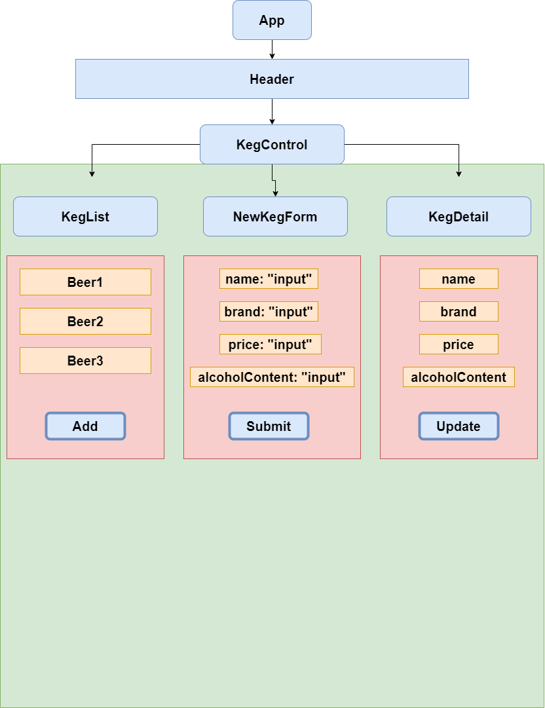

# _{Keg Counter - An Epicodus Code Review}_

#### By Zachary Green

#### _{This application lets a user create, view and delete beer from an inventory. Beers have information like name, brand, price and alcohol content. The user can buy a beer and have pints subtracted from a total amount of pints the keg contains.}_

## Technologies Used
* HTML
* CSS
* Bootstrap
* JavaScript
* Webpack
* Babel
* React
* https://www.draw.io for creating the Diagram

## Description

_{This program uses the NPX React-Create-App terminal command to create a start up template. A Components folder was later added with several components for the project. React works by using the same HTML document and creating a virtual version of that document where changes can be made based on user inputs. State is held in a parent component and this state is based as props to children components where a virtual version of the original state is managed. Requests to make changes can be posed by children components to the parent via functions and then handled via a setState. State can never be modified directly.}_

## Diagram

## Setup/Installation Requirements

* Visit https://github.com/Ultra-Zactimus/keg-counter-code-review
* Clone this repository to your desktop.
* Navigate to the top level of the directory in your terminal.
* Run "$ `npm install`"
* Run "$ `npm run build`" to build the project.
* Run "$ `npm start run`" to open a liveserver in the browser.

* Please refer to the `Available Scripts` section of this README for more information.

_{You do not need to add the `$` to the terminal commands. GitBash comes with that as a prefix on command line.}_

## Known Bugs

* The buy a Pint feature does not work. I was unable to figure out how to change the delete function into a function for decrementing the number. Probably gonna have this sussed by Monday.

## License

MIT

Copyright (c) 2022 Zachary Green  

## Available Scripts

In the project directory, you can run:

### `npm start`

Runs the app in the development mode.\
Open [http://localhost:3000](http://localhost:3000) to view it in your browser.

The page will reload when you make changes.\
You may also see any lint errors in the console.

### `npm test`

Launches the test runner in the interactive watch mode.\
See the section about [running tests](https://facebook.github.io/create-react-app/docs/running-tests) for more information.

### `npm run build`

Builds the app for production to the `build` folder.\
It correctly bundles React in production mode and optimizes the build for the best performance.

The build is minified and the filenames include the hashes.\
Your app is ready to be deployed!

See the section about [deployment](https://facebook.github.io/create-react-app/docs/deployment) for more information.

### `npm run eject`

**Note: this is a one-way operation. Once you `eject`, you can't go back!**

If you aren't satisfied with the build tool and configuration choices, you can `eject` at any time. This command will remove the single build dependency from your project.

Instead, it will copy all the configuration files and the transitive dependencies (webpack, Babel, ESLint, etc) right into your project so you have full control over them. All of the commands except `eject` will still work, but they will point to the copied scripts so you can tweak them. At this point you're on your own.

You don't have to ever use `eject`. The curated feature set is suitable for small and middle deployments, and you shouldn't feel obligated to use this feature. However we understand that this tool wouldn't be useful if you couldn't customize it when you are ready for it.

## Learn More

You can learn more in the [Create React App documentation](https://facebook.github.io/create-react-app/docs/getting-started).

To learn React, check out the [React documentation](https://reactjs.org/).

### Code Splitting

This section has moved here: [https://facebook.github.io/create-react-app/docs/code-splitting](https://facebook.github.io/create-react-app/docs/code-splitting)

### Analyzing the Bundle Size

This section has moved here: [https://facebook.github.io/create-react-app/docs/analyzing-the-bundle-size](https://facebook.github.io/create-react-app/docs/analyzing-the-bundle-size)

### Making a Progressive Web App

This section has moved here: [https://facebook.github.io/create-react-app/docs/making-a-progressive-web-app](https://facebook.github.io/create-react-app/docs/making-a-progressive-web-app)

### Advanced Configuration

This section has moved here: [https://facebook.github.io/create-react-app/docs/advanced-configuration](https://facebook.github.io/create-react-app/docs/advanced-configuration)

### Deployment

This section has moved here: [https://facebook.github.io/create-react-app/docs/deployment](https://facebook.github.io/create-react-app/docs/deployment)

### `npm run build` fails to minify

This section has moved here: [https://facebook.github.io/create-react-app/docs/troubleshooting#npm-run-build-fails-to-minify](https://facebook.github.io/create-react-app/docs/troubleshooting#npm-run-build-fails-to-minify)
